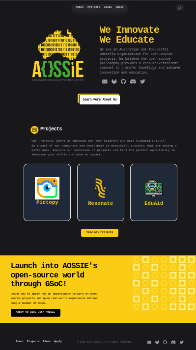
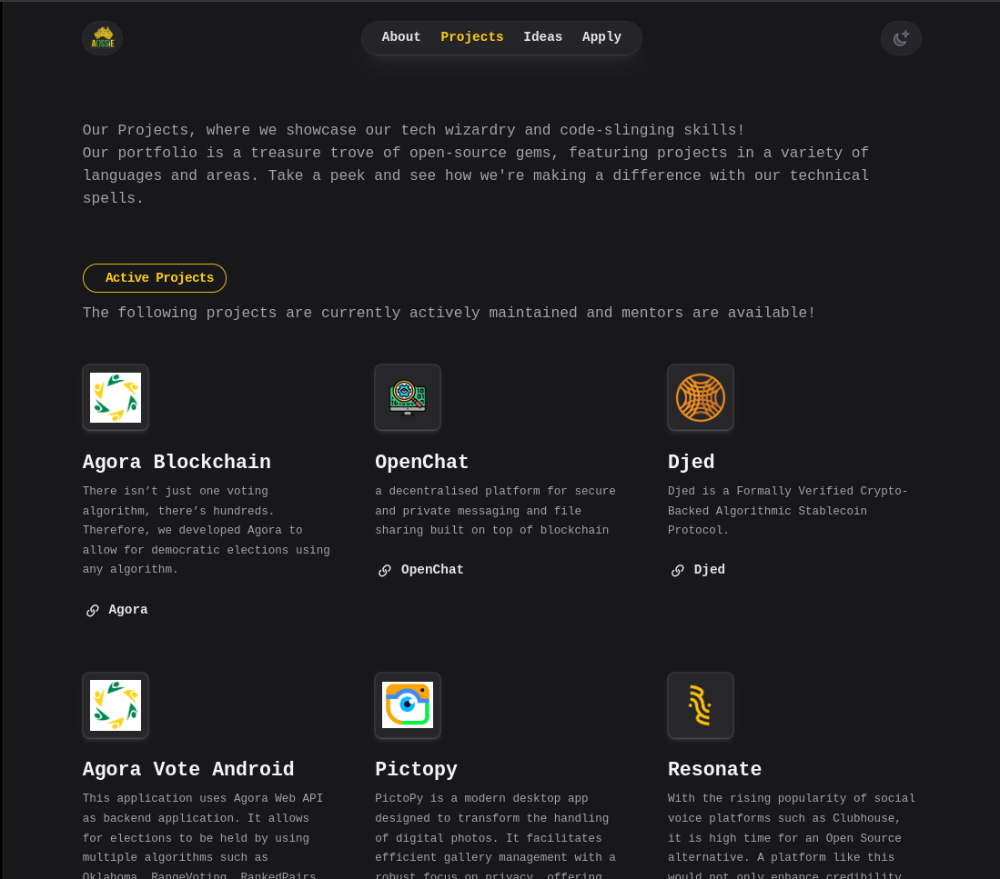
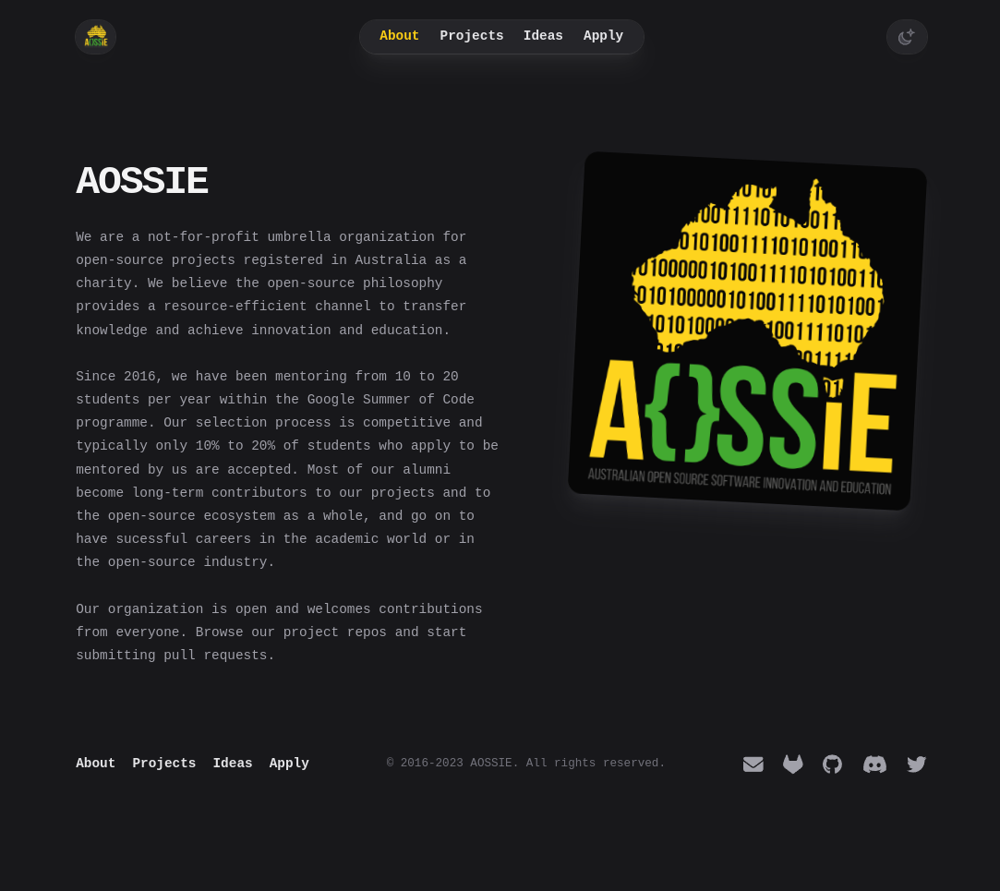

# **AOSSIE's Website**

This repository contains the assets required to build the **AOSSIE's website**. We're glad that you want to contribute!

Contributions to the project are very much welcomed! Please reach out with ideas for new content or issues with existing content!

Th website is a **Next.js** project using **Tailwind** for styling and design.

# **Getting Started**

To contribute to this repository you will need to:
- **Fork this repository**
- **Push changes to a new branch in your fork**
- **Create a pull request from that branch to the master branch of this repository**

Forking only needs to be done once, after which you can push changes to your fork.

# **Running the website Locally**

In order to run the site locally,
- Fork the website and clone that fork on your system
- Open a terminal/command prompt window and change the current directory to the directory of the cloned fork on your system.
- In the root directory, you can run the following commands:

```
npm install
npm run dev
```

``` 
yarn install
yarn dev
```

The website will be active at **http://localhost:3000**.


**Here is the some ScreenShots** 

- **Home Page**  
  
  
- **Projects Page**  
  
  
- **About Us Page**  
  


# **Contributing**

You can contribute by:

* Raising any issues you find
* Fixing issues by opening Pull Requests
* Improving website
* Talking about AOSSIE

# **Development Stack**

Frontend: Next.js, React
Styling: Tailwind CSS
Version Control: Git
Hosting: [Your hosting platform]

If you want to get in touch with us first before contributing, you can use:

* [AOSSIE Discord Channel](https://discord.com/invite/6mFZ2S846n)

# Acknowledgements
We'd like to thank all our contributors and the open-source community for their continuous support and contributions to AOSSIE.


# **License**
This project is licensed under the MIT License.

[**MIT License**](https://choosealicense.com/licenses/mit/)
